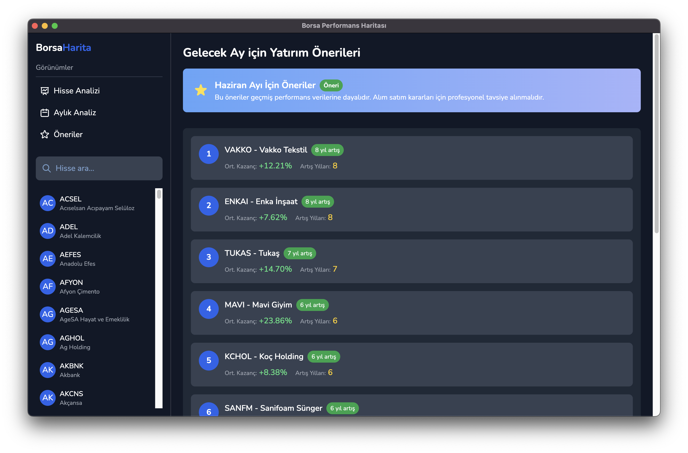

# BorsaHarita 📊

BorsaHarita, Borsa İstanbul (BIST) hisselerinin aylık performansını analiz etmenizi sağlayan bir masaüstü uygulamasıdır. Geçmiş performans verilerine dayanarak hangi hisselerin hangi aylarda daha iyi performans gösterdiğini tespit eder ve bu bilgiler ışığında yatırım önerileri sunar.



## 🚀 Özellikler

- **Hisse Analizi:** Tek bir hissenin geçmiş aylık performansını detaylı olarak inceleyin
- **Aylık Analiz:** Tüm hisselerin belirli aylardaki performansını karşılaştırın
- **Akıllı Öneriler:** Gelecek ay için en iyi performans göstermesi beklenen hisseleri görün
- **Takvim Görünümü:** Yıl-ay bazında renk kodlu performans haritası
- **Performans Grafikleri:** Görsel grafiklerle performans değişimini takip edin

## 💻 Kurulum

### İndirme Linkleri

- [macOS (Apple Silicon)](https://github.com/hikmetozcann/BorsaHarita/releases/latest/download/borsa-analiz-app-arm64.dmg)
- [macOS (Intel)](https://github.com/hikmetozcann/BorsaHarita/releases/latest/download/borsa-analiz-app-x64.dmg)
- [Windows](https://github.com/hikmetozcann/BorsaHarita/releases/latest/download/borsa-analiz-app-setup.exe)

### Elle Kurulum

1. Bu repoyu klonlayın:
   ```
   git clone https://github.com/hikmetozcann/BorsaHarita.git
   ```
2. Proje dizinine gidin:
   ```
   cd BorsaHarita
   ```
3. Bağımlılıkları yükleyin:
   ```
   npm install
   ```
4. Tailwind CSS'i derleyin:
   ```
   npm run build:css
   ```
5. Uygulamayı başlatın:
   ```
   npm start
   ```

## 🧰 Geliştirme

### Gereksinimler

- Node.js (>= 16.x)
- npm (>= 8.x)

### Geliştirme Ortamı

1. Geliştirici modunda çalıştırma:
   ```
   npm run dev
   ```

2. CSS değişikliklerini izleme:
   ```
   npm run watch:css
   ```

3. Uygulama paketi oluşturma:
   ```
   npm run build
   ```

## 📱 Kullanım Kılavuzu

### Hisse Analizi

1. Sol menüden "Hisse Analizi" görünümünü seçin
2. Hisse senedini, başlangıç ve bitiş tarihlerini belirleyin
3. "Performans Analizi Yap" butonuna tıklayın
4. Sonuçları grafikler ve takvim görünümünde inceleyin

### Aylık Analiz

1. Sol menüden "Aylık Analiz" görünümünü seçin
2. "Analizi Başlat" butonuna tıklayın
3. İstediğiniz ayı seçin
4. O ay için en iyi performans gösteren ve istikrarlı yükselen hisseleri görüntüleyin

### Öneriler

1. Sol menüden "Öneriler" görünümünü seçin
2. Gelecek ay için önerilen hisseleri inceleyin
3. Her bir önerinin artış yılı ve ortalama kazanç bilgisini görün

## 🔍 Nasıl Çalışır?

BorsaHarita, geçmiş verilere dayanarak hisselerin mevsimsel ve dönemsel performansını analiz eder. "İstikrarlı Yükselen Hisseler" algoritması, bir hissenin aynı ayda art arda kaç yıl yükseldiğini tespit eder ve bu hisseleri sıralar. Öneriler, en uzun süre istikrarlı artış gösteren ve ortalama kazancı en yüksek olan hisselere dayanır.

## 🛠️ Teknik Altyapı

- **Electron.js:** Çapraz platform masaüstü uygulaması
- **Chart.js:** Performans grafikleri için
- **Tailwind CSS:** Kullanıcı arayüzü tasarımı
- **Flatpickr:** Tarih seçici
- **Nunito Font:** Kullanıcı dostu tipografi

## 🚨 Sorumluluk Reddi

BorsaHarita'nın sağladığı analizler ve öneriler, yatırım tavsiyesi niteliğinde değildir. Tüm yatırım kararlarınızı profesyonel danışmanlardan yardım alarak vermeniz önerilir. Geçmiş performans, gelecekteki performansın garantisi değildir.

## 📝 Lisans

Bu proje MIT lisansı altında lisanslanmıştır. Daha fazla bilgi için [LICENSE](LICENSE) dosyasına bakın.

## 🙏 Katkıda Bulunanlar

- Hikmet Özcan ([@hikmetozcann](https://github.com/hikmetozcann)) - Ana geliştirici